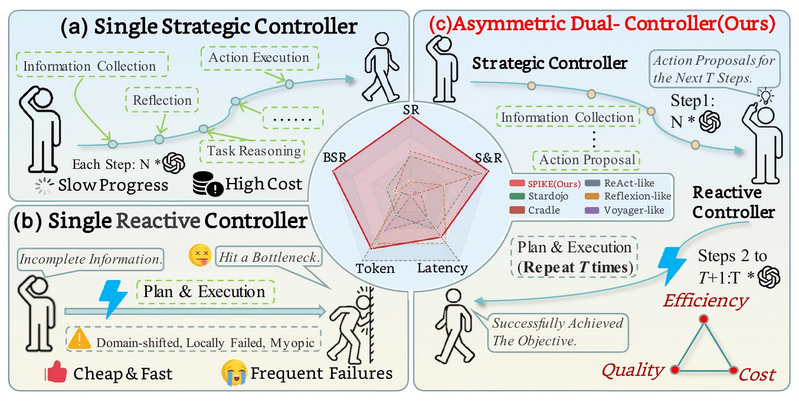
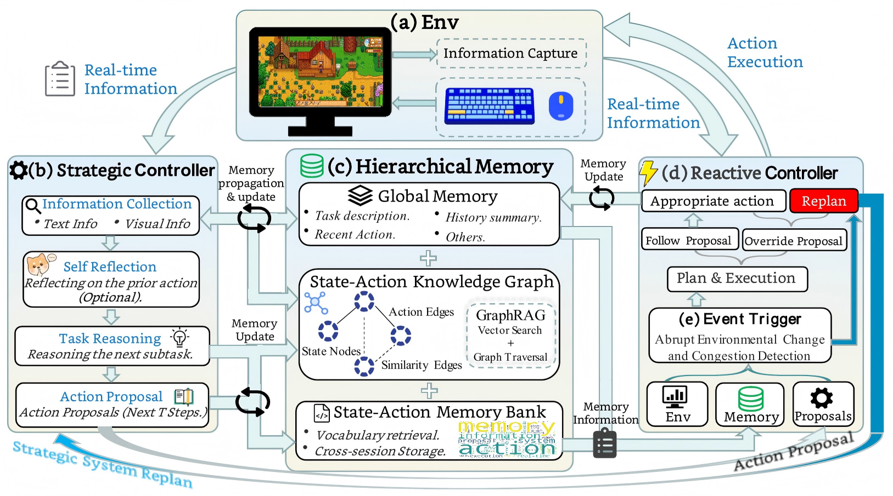

<h1 align="center">
  
  <span style="vertical-align: middle;">SPIKE</span>
</h1>

<p align="center">
  <strong>An Adaptive Dual Controller Framework for Cost-Efficient Long-Horizon Game Agents</strong>
</p>

<p align="center">
  <a href="https://openreview.net/profile?id=~Wencan_Jiang1"><strong>Wencan Jiang <sup>1</sup></strong></a>
  &middot;
  <a href="https://zhangzjn.github.io/"><strong>Jiangning Zhang <sup>1</sup></strong></a>
  &middot;
  <a href="https://jianbiaomei.github.io/"><strong>Jianbiao Mei <sup>1</sup></strong></a>
  &middot;
  <a href="https://github.com/Eddie0521"><strong>Jinzhuo Liu <sup>1</sup></strong></a>
  &middot;
  <a href="https://yuyang-cloud.github.io/"><strong>Yu Yang <sup>1</sup></strong></a>
  <br>
  <a href="https://scholar.google.com/citations?user=3lMuodUAAAAJ"><strong>Xiaobin Hu <sup>2</sup></strong></a>
  &middot;
  <a href="https://scholar.google.com/citations?hl=zh-CN&user=m3KDreEAAAAJ"><strong>Zhucun Xue <sup>1</sup></strong></a>
  &middot;
  <a href="https://person.zju.edu.cn/en/yongliu"><strong>Yong Liu <sup>1</sup></strong></a>
  &middot;
  <a href="https://dr.ntu.edu.sg/cris/rp/rp02343"><strong>Dacheng Tao <sup>3</sup></strong></a>
</p>

<p align="center">
  <strong><sup>1</sup>Zhejiang University</strong> &nbsp;&nbsp;&nbsp;
  <strong><sup>2</sup>National University of Singapore</strong> &nbsp;&nbsp;&nbsp;
  <strong><sup>3</sup>Nanyang Technological University</strong>
</p>

<p align="center">
  <a href="">
    
  </a>
  <a href="https://rinke02.github.io/wencanjiang.github.io/projects/SPIKE/">
    
  </a>
  <a href="">
    
  </a>
</p>

<a name="highlight"></a>

# Highlight



SPIKE is designed for long-horizon multimodal agents that must remain goal-directed over many low-level interactions under token and latency constraints.

1. **Event-triggered amortized deliberation:** Strategic reasoning is reused across stable local segments and reinvoked at visual, progress, repetition, or failure boundaries.
2. **Adaptive dual-controller execution:** A Strategic Controller handles planning and recovery, while a bounded Reactive Controller performs fast local execution and local override.
3. **Controller-specific hierarchical memory:** SPIKE separates State-Action Memory Bank retrieval for routine execution from State-Action Knowledge Graph evidence for replanning.
4. **Better success-cost trade-off:** On StarDojo Lite-100, SPIKE improves success over the strongest baseline while reducing tokens and latency.

<a name="contents"></a>

# Summary of Contents

- [Highlight](#highlight)
- [Summary of Contents](#contents)
- [Method Overview](#method-overview)
- [Installation](#installation)
    - [1. Prepare the game environment](#1-prepare-the-game-environment)
    - [2. Install the Python runtime](#2-install-the-python-runtime)
    - [3. Configure local environment](#3-configure-local-environment)
- [Configuration](#configuration)
- [Resources](#resources)
- [Components](#components)
- [Usage](#usage)
    - [Useful scripts](#useful-scripts)
- [Reproducibility Notes](#reproducibility-notes)
- [Verification](#verification)
- [Citation](#citation)
- [Contact](#contact)

<a name="method-overview"></a>

# Method Overview



**SPIKE framework.** SPIKE uses event-triggered switching to reserve strategic deliberation for discontinuities while reactive execution handles stable local progress.

<a name="installation"></a>

# Installation

### 1. Prepare the game environment

For Stardew Valley, SMAPI, StarDojoMod, and other game-side setup details, follow the official [StarDojo](https://github.com/StarDojo2025/stardojo) instructions.

### 2. Install the Python runtime

```powershell
git clone https://github.com/Rinke02/SPIKE.git
cd SPIKE
conda create -n Spike python=3.10.9
conda activate Spike
python -m pip install -r requirements.txt
python -m pip install -e ./agent
```

### 3. Configure local environment

Create your local environment file:

```powershell
Copy-Item env/.env.example env/.env
```

Fill in `env/.env` with your local `STARDEW_APP_PATH` and the API key variables referenced by the config you use. Do not commit `env/.env`; it is ignored by Git.

Set project paths for the current Windows PowerShell session:

```powershell
.\setup.ps1
```

<a name="configuration"></a>

# Configuration

This source release includes public templates for Qwen, OpenAI-compatible, and Gemini runs:

```text
agent/conf/qwen_config.json
agent/conf/openai_config.json
agent/conf/gemini_config.json
agent/conf/env_config_stardew.json
```

The public config files keep model names and embedding settings, but do not contain private keys or service URLs. Fill in `base_url`, `emb_base_url`, `api_key`, `emb_api_key`, or the corresponding environment variables for your own provider.

<a name="resources"></a>

# Resources

The required Stardew task save folders are included under:

```text
env/tasks/saves/save_new
env/tasks/saves/save_farming
env/tasks/saves/save_quests
```

The default text embedding model is [BAAI/bge-base-en-v1.5](https://huggingface.co/BAAI/bge-base-en-v1.5). When this model is used through `sentence-transformers`, it can be downloaded automatically on first use or prepared in your local Hugging Face cache in advance. Model files and local cache directories are not included in this repository.

The default visual embedding is local-image-embedding-v1, a deterministic local image feature extractor implemented in agent/cradle/runner/image_embedder.py.

The public release includes a small sanitized memory seed at:

```text
agent/res/stardew/memory/stardew_valley_mem0_seed.jsonl
```

This seed contains successful state-action examples only. It does not include full run logs, screenshots, videos, local paths, API keys, or model weights. Runtime memory and history remain local under ignored directories such as `runs/`, `cache/`, `agent/cache/`, and `env/cache/`.

<a name="components"></a>

# Components

- `agent/`: core SPIKE agent package, including controller logic, memory modules, Stardew integration, resources, and model configuration templates.
- `StardojoMod/`: public SMAPI mod source used by the StarDojo-based Stardew Valley runtime.
- `env/`: Stardew runner code, task suites, save folders, game data, and environment utilities.
- `run_lite100_parallel.py`: standard Lite-100 parallel benchmark entry point.
- `summarize_run_results.py`: helper script for summarizing run outputs.
- `tests/`: public smoke tests for the Lite-100 runner and local embedding defaults.

<a name="usage"></a>

# Usage

Run from the repository root with `Spike` activated.

```powershell
python run_lite100_parallel.py --dry_run --llm_config agent/conf/qwen_config.json --embed_config agent/conf/qwen_config.json
```

Replace the config paths with the provider templates under `agent/conf/` as needed. Remove `--dry_run` after completing the game-side setup in [StarDojo](https://github.com/StarDojo2025/stardojo), preparing `env/.env`, and filling in the required model provider settings.

### Useful scripts

- `run_lite100_parallel.py`: standard Lite-100 parallel benchmark.
- `summarize_run_results.py`: summarize benchmark outputs.
- `verify_qwen_no_key.py`: check Qwen config behavior without publishing keys.

Runtime output is written under `runs/`, which is ignored by Git.

<a name="reproducibility-notes"></a>

# Reproducibility Notes

- Use a clean clone or clear ignored runtime directories when you want a history-free evaluation.
- Keep `runs/`, `cache/`, `agent/cache/`, and `env/cache/` local. These directories may contain runtime history used by memory components.
- `agent/conf/enhanced_config.yaml` keeps `features.use_mem0: false` by default for a clean public baseline. If you enable Mem0 and no local memory exists, the sanitized public seed is loaded automatically.
- Parallel reset diagnostics now include `last_reset_stage` and full reset tracebacks in task metadata when reset fails.
- The shared-memory reader waits for the SMAPI mmap file to be ready before mapping it, reducing intermittent Windows reset failures such as `[Errno 22] Invalid argument`.
- The public release does not include pretrained visual model weights. Large model artifacts should stay in local caches outside Git.

<a name="verification"></a>

# Verification

After installation, run the public smoke tests:

```powershell
python -m pytest -q
```

You can also check the Lite-100 command generation without launching Stardew Valley:

```powershell
python run_lite100_parallel.py --dry_run --llm_config agent/conf/qwen_config.json --embed_config agent/conf/qwen_config.json
```

For an actual game-side smoke test, use a configured `env/.env` and your own model provider settings, then run a small Lite-100 subset or the full standard Lite-100 entry point.

<a name="citation"></a>

# Citation

<a name="contact"></a>

# Contact

For issues or contributions, feel free to open an issue or pull request.
