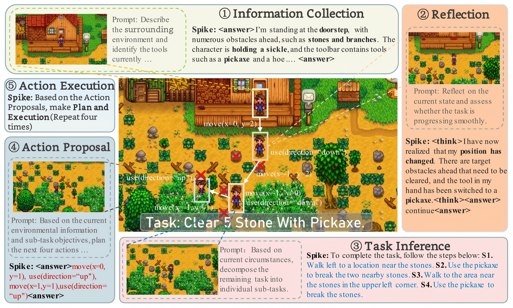
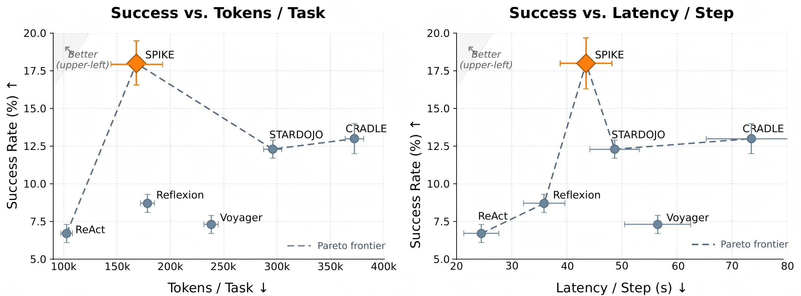
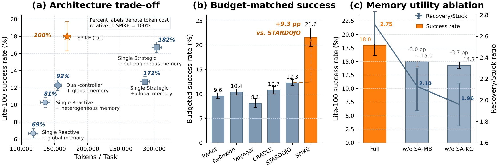
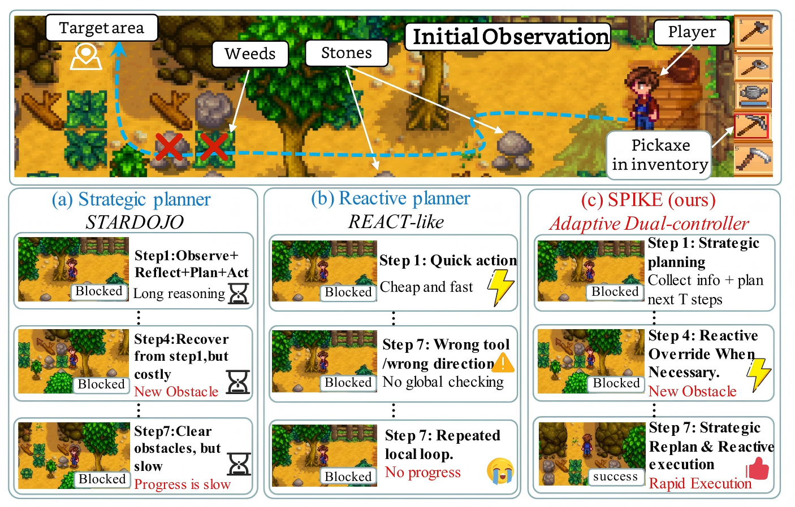

<p align="center">
  <a href="">
     <strong><span style="font-size: 24px; vertical-align: middle;">SPIKE</span></strong>
  </a>
</p>

<p align="center">
  <strong>An Adaptive Dual Controller Framework for Cost-Efficient Long-Horizon Game Agents</strong>
</p>

<p align="center">
  <a href="https://openreview.net/profile?id=~Wencan_Jiang1"><strong>Wencan Jiang <sup>1</sup></strong></a>
  ·
  <a href="https://zhangzjn.github.io/"><strong>Jiangning Zhang <sup>1</sup></strong></a>
  ·
  <a href="https://jianbiaomei.github.io/"><strong>Jianbiao Mei <sup>1</sup></strong></a>
  ·
  <a href="https://github.com/Eddie0521"><strong>Jinzhuo Liu <sup>1</sup></strong></a>
  ·
  <a href="https://yuyang-cloud.github.io/"><strong>Yu Yang <sup>1</sup></strong></a>
  <br>
  <a href="https://scholar.google.com/citations?user=3lMuodUAAAAJ"><strong>Xiaobin Hu <sup>2</sup></strong></a>
  ·
  <a href="https://scholar.google.com/citations?hl=zh-CN&user=m3KDreEAAAAJ"><strong>Zhucun Xue <sup>1</sup></strong></a>
  ·
  <a href="https://person.zju.edu.cn/en/yongliu"><strong>Yong Liu <sup>1</sup></strong></a>
  ·
  <a href="https://dr.ntu.edu.sg/cris/rp/rp02343"><strong>Dacheng Tao <sup>3</sup></strong></a>
</p>

<p align="center">
  <strong><sup>1</sup>Zhejiang University</strong> &nbsp;&nbsp;&nbsp;
  <strong><sup>2</sup>National University of Singapore</strong> &nbsp;&nbsp;&nbsp;
  <strong><sup>3</sup>Nanyang Technological University</strong>
</p>

<p align="center">
  <a href="">
    
  </a>
  <a href="">
    
  </a>
  <a href="">
    
  </a>
</p>

<a name="introduction"></a>

# Continuous Updates

This repository contains the minimal public source release for **SPIKE**, an adaptive dual-controller framework for cost-efficient long-horizon multimodal game agents.

SPIKE treats strategic reasoning as a budgeted resource. An Event Trigger decides when to deliberate, a Strategic Controller handles planning and recovery, a Reactive Controller executes low-cost local actions, and Hierarchical Memory retrieves controller-specific evidence.

This source snapshot keeps the core Python agent, Stardew environment, SMAPI mod source, task suites, benchmark helper scripts, and public configuration templates. It intentionally excludes local run outputs, caches, screenshots, private `.env` files, game-save snapshots, generated documentation, and large experiment artifacts.

**Update:**

- **[2026-05-13]** Initial public source snapshot prepared.
- **[Coming soon]** arXiv, project website, paper link, leaderboard, and citation.

<a name="highlight"></a>

# Highlight


SPIKE is designed for long-horizon multimodal agents that must remain goal-directed over many low-level interactions under token and latency constraints.

1. **Event-triggered amortized deliberation:** Strategic reasoning is reused across stable local segments and reinvoked at visual, progress, repetition, or failure boundaries.
2. **Adaptive dual-controller execution:** A Strategic Controller handles planning and recovery, while a bounded Reactive Controller performs fast local execution and local override.
3. **Controller-specific hierarchical memory:** SPIKE separates State-Action Memory Bank retrieval for routine execution from State-Action Knowledge Graph evidence for replanning.
4. **Better success-cost trade-off:** On StarDojo Lite-100, SPIKE improves success over the strongest baseline while reducing tokens and latency.

<a name="contents"></a>

# Summary of Contents

- [Continuous Updates](#continuous-updates)
- [Highlight](#highlight)
- [Summary of Contents](#summary-of-contents)
- [Method Overview](#method-overview)
- [Installation](#installation)
    - [1. Install prerequisites](#1-install-prerequisites)
    - [2. Install requirements](#2-install-requirements)
    - [3. Configure local environment](#3-configure-local-environment)
    - [4. Build or install the mod](#4-build-or-install-the-mod)
- [Configuration](#configuration)
- [Usage](#usage)
    - [Qwen](#qwen)
    - [OpenAI](#openai)
    - [Gemini with Qwen embeddings](#gemini-with-qwen-embeddings)
    - [Useful scripts](#useful-scripts)
- [Experiments](#experiments)
- [Citation](#citation)
- [Contact](#contact)

<a name="method-overview"></a>

# Method Overview


**SPIKE framework.** SPIKE uses event-triggered switching to reserve strategic deliberation for discontinuities while reactive execution handles stable local progress.



**Strategic Controller workflow.** When escalation is triggered, the Strategic Controller gathers state evidence, retrieves memory, reasons over subtasks, and proposes the next actions.

<a name="installation"></a>

# Installation

### 1. Install prerequisites

- Windows
- Python 3.10.9
- Conda environment named `cradle_modify`
- Stardew Valley
- SMAPI installed for Stardew Valley
- `StarDojoMod` built from `StardojoMod/` or installed into the Stardew Valley `Mods` directory

### 2. Install requirements

```powershell
git clone <your-spike-repo-url>
cd spike
conda create -n cradle_modify python=3.10.9
conda activate cradle_modify
python -m pip install -r requirements.txt
python -m pip install -e ./agent
```

### 3. Configure local environment

Create your local environment file:

```powershell
Copy-Item env/.env.example env/.env
```

Fill in `env/.env` with your local `STARDEW_APP_PATH` and the model API key you plan to use.

Set project paths for the current Windows PowerShell session:

```powershell
.\setup.ps1
```

### 4. Build or install the mod

Open `StardojoMod/StardojoMod.sln` in Visual Studio or a compatible C# environment, build the project, and copy the output into your Stardew Valley `Mods` directory if your build setup does not do so automatically.

<a name="configuration"></a>

# Configuration

This source release includes public templates for Qwen, OpenAI, and Gemini:

```text
agent/conf/qwen_config.json
agent/conf/openai_config.json
agent/conf/gemini_config.json
agent/conf/env_config_stardew.json
```

Qwen uses DashScope's OpenAI-compatible API by default. Set `DASHSCOPE_API_KEY` in `env/.env`.

OpenAI uses `OPENAI_API_KEY`.

Gemini uses `GEMINI_API_KEY`. For Gemini runs, keep embeddings on Qwen or OpenAI by pointing `--embed_config` to `qwen_config.json` or `openai_config.json`.

Claude, Azure, and private REST Claude configs are not part of this minimal public configuration.

<a name="usage"></a>

# Usage

Run from the repository root with `cradle_modify` activated.

### Qwen

```powershell
python run_lite100_parallel.py --dry_run --llm_config agent/conf/qwen_config.json --embed_config agent/conf/qwen_config.json
```

### OpenAI

```powershell
python run_lite_diagnostic_parallel.py --dry_run --llm_config agent/conf/openai_config.json --embed_config agent/conf/openai_config.json
```

### Gemini with Qwen embeddings

```powershell
python run_regression_focused.py --dry_run --llm_config agent/conf/gemini_config.json --embed_config agent/conf/qwen_config.json
```

Remove `--dry_run` when your Stardew Valley, SMAPI, mod, and API keys are ready.

### Useful scripts

- `run_lite100_parallel.py`: full Lite100 parallel benchmark
- `run_lite100_bigbrain_only.py`: Lite100 BigBrain-only variant
- `run_lite_diagnostic_parallel.py`: smaller diagnostic subset
- `run_regression_focused.py`: focused regression task suite
- `summarize_run_results.py`: summarize benchmark outputs
- `verify_qwen_no_key.py`: check Qwen config behavior without publishing keys

Runtime output is written under `runs/`, which is ignored by Git.

<a name="experiments"></a>

# Experiments



**Effectiveness-efficiency trade-off on Lite-100.** The two panels compare success against token use and latency; upper-left is better.



**Mechanistic analysis.** Controller allocation and hierarchical memory explain the gains in recovery, efficiency, and sustained task progress.



**Qualitative analysis.** Coming soon.

For now, you can run focused public-path checks:

```powershell
python -m pytest tests/test_run_lite100_parallel.py tests/test_parallel_worker_guard.py -q
```

<a name="citation"></a>

# Citation

Coming soon.

```bibtex
@misc{spike2026,
  title        = {SPIKE: An Adaptive Dual Controller Framework for Cost-Efficient Long-Horizon Game Agents},
  author       = {Coming soon},
  year         = {2026},
  note         = {Coming soon}
}
```

<a name="contact"></a>

# Contact

Coming soon.
